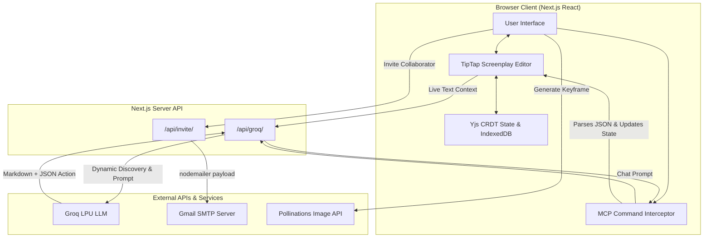

```mermaid
graph TD
    subgraph Client ["Browser Client (Next.js React)"]
        UI["User Interface"]
        Editor["TipTap Screenplay Editor"]
        Yjs["Yjs CRDT State & IndexedDB"]
        Agent["MCP Command Interceptor"]
        
        UI <--> Editor
        Editor <--> Yjs
        UI --> Agent
    end

    subgraph APITier ["Next.js Server API"]
        GroqRoute["/api/groq/"]
        InviteRoute["/api/invite/"]
    end

    subgraph External ["External APIs & Services"]
        GroqLLM["Groq LPU LLM"]
        SMTP["Gmail SMTP Server"]
        Pollinations["Pollinations Image API"]
    end

    Editor -- "Live Text Context" --> GroqRoute
    Agent -- "Chat Prompt" --> GroqRoute
    
    GroqRoute -- "Dynamic Discovery & Prompt" --> GroqLLM
    GroqLLM -- "Markdown + JSON Action" --> GroqRoute
    GroqRoute --> Agent
    
    Agent -- "Parses JSON & Updates State" --> Editor
    
    UI -- "Generate Keyframe" --> Pollinations
    UI -- "Invite Collaborator" --> InviteRoute
    InviteRoute -- "nodemailer payload" --> SMTP
```
